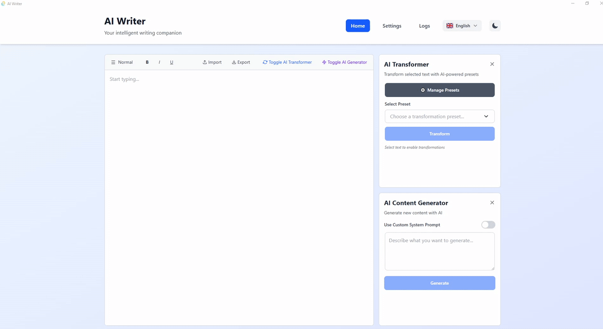

# AI Writer - Intelligent Writing Assistant

A modern desktop application combining rich text editing with AI-powered content generation and transformation.

## Demo



## Key Features

- **🤖 Multi-Provider AI Support** - OpenAI, Anthropic, or Local Qwen models
- **✍️ Rich Text Editor** - Professional editing powered by Lexical
- **⚡ Real-Time AI Streaming** - Live content generation and transformation
- **🎯 Transformation Presets** - Save and reuse custom text transformation prompts
- **💾 Persistent Workspace** - Automatic saving of editor content and settings
- **🌓 Dark/Light Themes** - Comfortable writing in any lighting condition
- **📊 System Monitoring** - AI model status, application logs, and system information
- **🌍 Internationalization** - Multi-language support (English, French)
- **🔒 Privacy-First** - Desktop app with local storage and optional local AI models

## Capabilities

- Generate content from prompts with streaming AI responses
- Transform selected text with AI (e.g., "Make it professional", "Simplify", "Expand")
- Configure and switch between AI providers with adjustable parameters
- Monitor AI model status, logs, and system specs

## Quick Start

### Prerequisites

- [Node.js](https://nodejs.org/) v18 or higher
- [pnpm](https://pnpm.io/) v8 or higher
- [Rust](https://www.rust-lang.org/) latest stable
- [Tauri Prerequisites](https://tauri.app/v2/guides/prerequisites/) for your platform

### Installation

```bash
# Clone the repository
git clone <repository-url>
cd ai-writer

# Install dependencies
pnpm install

# Run in development mode
pnpm tauri dev
```

### Build for Production

```bash
# Build the application
pnpm tauri build
```

The built application will be available in `src-tauri/target/release/`.

## Technology Stack

### Frontend
- **React 19** - Modern UI library with latest features
- **TypeScript** - Type-safe development
- **Tailwind CSS 4** - Utility-first styling
- **Lexical** - Extensible rich text editor framework
- **Vite** - Fast build tooling
- **React Router 7** - Client-side routing

### Backend
- **Rust** - High-performance systems language
- **Tauri 2** - Secure desktop application framework
- **Serde** - Serialization/deserialization
- **Tokio** - Async runtime for AI streaming

### AI Integration
- **OpenAI API** - GPT models
- **Anthropic API** - Claude models
- **Local Qwen** - Privacy-focused local models

## Project Structure

```
ai-writer/
├── src/                          # Frontend application
│   ├── features/                 # Feature modules
│   │   ├── ai-runtime/          # AI streaming & status monitoring
│   │   ├── ai-settings/         # AI provider configuration
│   │   ├── editor/              # Rich text editor with AI
│   │   ├── logging/             # Application logging viewer
│   │   ├── system-info/         # System information display
│   │   └── app-restart/         # Application restart management
│   ├── pages/                   # Page components
│   ├── shared/                  # Shared utilities & components
│   │   ├── ui/                  # Reusable UI components
│   │   ├── i18n/                # Internationalization
│   │   ├── theme/               # Theme management
│   │   └── layouts/             # Layout components
│   └── main.tsx                 # Application entry point
│
└── src-tauri/                   # Backend application
    └── src/
        ├── ai/                  # AI provider implementations
        ├── commands/            # Tauri command handlers
        ├── config/              # Configuration management
        ├── editor/              # Editor persistence
        └── logging/             # Logging system
```

## Feature Documentation

Each feature has detailed documentation in its respective directory:

- [AI Runtime](src/features/ai-runtime/README.md) - AI streaming and model status
- [AI Settings](src/features/ai-settings/README.md) - Provider configuration
- [Editor](src/features/editor/README.md) - Rich text editing with AI
- [Logging](src/features/logging/README.md) - Application log viewer
- [System Info](src/features/system-info/README.md) - System specifications
- [App Restart](src/features/app-restart/README.md) - Restart management

## Development

### Available Commands

```bash
# Frontend development server
pnpm dev

# Tauri development (with hot-reload)
pnpm tauri dev

# Build frontend
pnpm build

# Build Tauri application
pnpm tauri build

# Preview production build
pnpm preview
```

### Code Organization

This project follows clean architecture principles:

- **Feature-based structure** - Each feature is self-contained
- **Dependency Inversion** - High-level modules depend on abstractions
- **SOLID principles** - Maintainable and extensible code
- **TypeScript strict mode** - Type safety throughout
- **Rust best practices** - Idiomatic Rust with proper error handling

See individual feature READMEs for detailed implementation guidelines.
