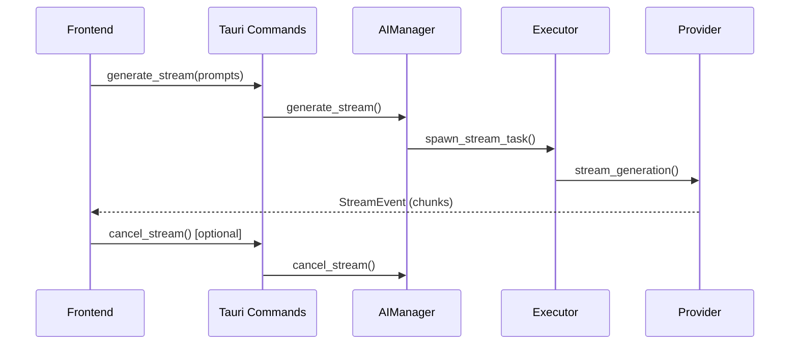

# AI Runtime Feature Documentation

## Overview

The AI Runtime feature provides comprehensive runtime management for AI models, enabling real-time monitoring, streaming AI responses, and unified interaction with multiple AI providers (OpenAI, Anthropic, LocalQwen).

## Architecture

### Frontend (`src/features/ai-runtime/`)

```
src/features/ai-runtime/
├── components/          # UI components (ModelStatusIndicator)
├── hooks/              # React hooks (useAIRuntime, useAiStatus)
├── services/           # Tauri command wrappers
├── types.ts            # TypeScript definitions
└── index.ts            # Public API exports
```

**Key Components:**
- `useAIRuntime()`: Manages streaming operations with start/cancel/clear functionality
- `useAiStatus()`: Monitors model status with automatic polling
- `ModelStatusIndicator`: Visual status display component

### Backend (`src-tauri/src/ai/`)

```
src-tauri/src/ai/
├── manager.rs           # AIManager (coordinator)
├── executor.rs          # Stream execution handler
├── state.rs             # Operation state management
├── types.rs             # Core type definitions
├── providers/           # AI provider implementations
└── model_manager/       # Model lifecycle management
```

**Core Components:**
- **AIManager**: Routes requests, tracks status, manages providers
- **Executor**: Handles async streaming tasks, emits events
- **StateManager**: Prevents concurrency, manages cancellation
- **Providers**: Implementations for OpenAI, Anthropic, LocalQwen

## Integration Flow



## API Reference

### Frontend Hooks

- `useAIRuntime()`: Returns `{isStreaming, currentStream, error, startStream, cancelStream, clearStream}`
- `useAiStatus()`: Returns `{status: ModelStatus}`

### Backend Commands

- `get_model_status()`: Returns current ModelStatus
- `generate_stream(system_prompt, user_prompt)`: Starts streaming, returns request_id
- `cancel_stream()`: Cancels current operation

### Types

**ModelStatus**: `'Unloaded' | 'Loading' | 'Loaded' | 'Error'` with provider/model details

**StreamEvent**: `'Started' | 'Chunk' | 'Completed' | 'Error' | 'Cancelled'` with request tracking

## Key Features

- **Multi-Provider Support**: Seamless switching between AI services
- **Streaming Generation**: Real-time token-by-token output
- **Concurrency Control**: One operation at a time
- **Event-Driven Updates**: Reactive UI via Tauri events
- **Error Handling**: Comprehensive error propagation
- **Cancellation**: Graceful operation termination

## Usage Example

```tsx
import { useAIRuntime, useAiStatus, ModelStatusIndicator } from '@/features/ai-runtime';

function AIComponent() {
  const { status } = useAiStatus();
  const { isStreaming, currentStream, startStream, cancelStream } = useAIRuntime();

  return (
    <div>
      <ModelStatusIndicator status={status} />
      <button onClick={() => startStream("System prompt", "User prompt")} disabled={isStreaming}>
        Generate
      </button>
      {isStreaming && <button onClick={cancelStream}>Cancel</button>}
      <div>{currentStream}</div>
    </div>
  );
}