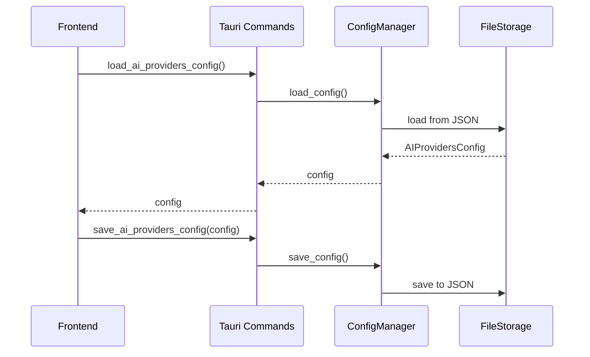

# AI Settings Feature Documentation

## Overview

The AI Settings feature provides a comprehensive interface for configuring AI providers (OpenAI, Anthropic, LocalQwen), managing model parameters, API keys, and runtime settings with form validation and persistence.

## Architecture

### Frontend (`src/features/ai-settings/`)

```
src/features/ai-settings/
├── components/          # UI components (AIProviderSettings, provider forms)
├── hooks/              # React hooks (useProviderSettings, useFormValidation)
├── services/           # Tauri command wrappers
├── types.ts            # TypeScript definitions
├── validation.ts       # Zod schemas
└── index.ts            # Public API exports
```

**Key Components:**
- `AIProviderSettings`: Main container for provider configuration
- Provider forms: `OpenAISettings`, `AnthropicSettings`, `LocalQwenSettings`
- `ActiveProviderButton`: Provider switching component

**Key Hooks:**
- `useProviderSettings`: Manages config state and persistence
- `useFormValidation`: Zod-based form validation
- `useQwenModels`: Local Qwen model discovery

### Backend (`src-tauri/src/config/`)

```
src-tauri/src/config/
├── manager.rs           # ConfigManager (business logic)
├── storage.rs           # FileConfigStorage (JSON persistence)
├── types.rs             # Configuration data structures
└── mod.rs               # Public API
```

**Core Components:**
- **ConfigManager**: Orchestrates config loading/saving
- **FileConfigStorage**: JSON-based filesystem persistence
- **AIProvidersConfig**: Contains all provider configurations

## Integration Flow



## API Reference

### Frontend Hooks

- `useProviderSettings()`: Returns `{config, updateConfig, saveConfig, isLoading}`
- `useFormValidation(schema)`: Returns `{errors, validate, clearErrors}`
- `useQwenModels()`: Returns `{models, scanModels, isScanning}`

### Backend Commands

- `load_ai_providers_config()`: Returns AIProvidersConfig
- `save_ai_providers_config(config)`: Saves provider configuration

### Types

**AIProvidersConfig**: `{activeProvider, openai, anthropic, localQwen}`

**Provider Configs**: OpenAIConfig, AnthropicConfig, LocalQwenConfig with API keys, models, parameters

### Validation

Zod schemas for each provider with i18n error messages:
- `openAIConfigSchema`
- `anthropicConfigSchema`
- `localQwenConfigSchema`

## Key Features

- **Multi-Provider Support**: OpenAI, Anthropic, LocalQwen configurations
- **Form Validation**: Zod schemas with internationalization
- **Persistent Storage**: JSON-based configuration persistence
- **Model Discovery**: Automatic Local Qwen model scanning
- **Provider Switching**: Dynamic active provider selection
- **Parameter Management**: Temperature, tokens, context size controls

## Usage Example

```tsx
import { AIProviderSettings } from '@/features/ai-settings';

function SettingsPage() {
  return (
    <div>
      <h1>AI Settings</h1>
      <AIProviderSettings />
    </div>
  );
}
```

```tsx
import { useProviderSettings } from '@/features/ai-settings';

function CustomSettings() {
  const { config, updateConfig, saveConfig } = useProviderSettings();

  const handleSave = async () => {
    await saveConfig();
  };

  return (
    <form onSubmit={handleSave}>
      {/* Form fields */}
    </form>
  );
}