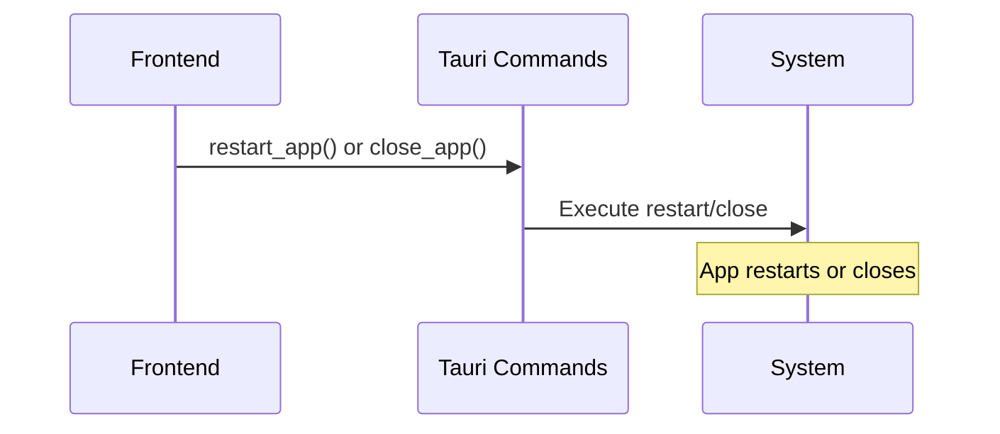

# App Restart Feature Documentation

## Overview

The App Restart feature provides a user-friendly interface for restarting or closing the Tauri application, with different behaviors in development vs production modes and built-in loading states.

## Architecture

### Frontend (`src/features/app-restart/`)

```
src/features/app-restart/
├── components/          # UI components (RestartPrompt)
├── contexts/           # React context (AppRestartProvider)
├── hooks/              # React hooks (useAppRestart)
├── services/           # Tauri command wrappers
├── types.ts            # TypeScript definitions
└── index.ts            # Public API exports
```

**Key Components:**
- `RestartPrompt`: Banner component for restart/close actions
- `AppRestartProvider`: Context provider for state management

**Key Hooks:**
- `useAppRestart`: Manages restart/close operations with loading states
- `useAppRestartPrompt`: Controls prompt visibility

### Backend (`src-tauri/src/commands/system_commands.rs`)

**Commands:**
- `restart_app()`: Restarts the application
- `close_app()`: Closes the application

## Integration Flow



## API Reference

### Frontend Hooks

- `useAppRestart()`: Returns `{restart, close, isRestarting, error}`
- `useAppRestartPrompt()`: Returns `{showRestartPrompt, setShowRestartPrompt}`

### Backend Commands

- `restart_app()`: Restarts the application
- `close_app()`: Closes the application

### Types

**AppRestartService**: Interface with `restart()` and `close()` methods

## Key Features

- **Mode-Aware**: Different actions for development (close) vs production (restart)
- **Loading States**: Built-in loading indicators during operations
- **Error Handling**: Comprehensive error propagation
- **Context-Based**: React context for global state management
- **Internationalization**: i18n support for messages

## Usage Example

```tsx
import { AppRestartProvider, RestartPrompt, appRestartService } from '@/features/app-restart';

function App() {
  return (
    <AppRestartProvider service={appRestartService}>
      <div>
        {/* App content */}
        <RestartPrompt />
      </div>
    </AppRestartProvider>
  );
}
```

```tsx
import { useAppRestartPrompt } from '@/features/app-restart';

function Settings() {
  const { setShowRestartPrompt } = useAppRestartPrompt();

  return (
    <button onClick={() => setShowRestartPrompt(true)}>
      Restart App
    </button>
  );
}