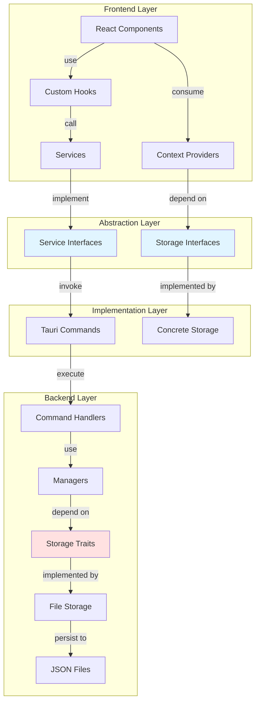
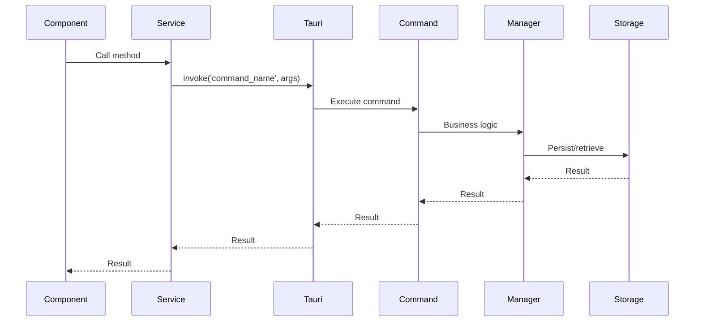
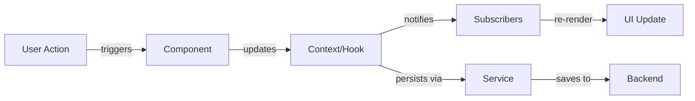

# Architecture Overview

## Introduction

This application is built using a modern tech stack with Tauri for native desktop capabilities, React 19 for the frontend, and Rust for the backend. The architecture emphasizes clean code principles, particularly the SOLID principles and Dependency Inversion Principle (DIP).

## Technology Stack

### Frontend
- **React 19**: Latest React with new hooks and features
- **TypeScript**: Type-safe JavaScript
- **Tailwind CSS 4**: Utility-first CSS framework
- **Vite**: Fast build tool and dev server
- **React Router 7**: Client-side routing
- **EditorJS**: Block-styled rich text editor

### Backend
- **Rust**: Systems programming language
- **Tauri 2**: Framework for building desktop applications
- **Serde**: Serialization/deserialization
- **Tokio**: Async runtime (implicit via Tauri)

## Architecture Diagram



## Design Principles

### 1. Dependency Inversion Principle (DIP)

**Definition**: High-level modules should not depend on low-level modules. Both should depend on abstractions.

#### Implementation Examples

**Configuration System:**
```rust
// High-level module depends on abstraction
pub struct ConfigManager<S: ConfigStorage> {
    storage: Arc<S>,
}

// Abstraction (trait)
pub trait ConfigStorage: Send + Sync {
    fn load(&self) -> Result<AppConfig, ConfigError>;
    fn save(&self, config: &AppConfig) -> Result<(), ConfigError>;
}

// Low-level module implements abstraction
pub struct FileConfigStorage {
    file_path: PathBuf,
}

impl ConfigStorage for FileConfigStorage {
    // Implementation
}
```

**Theme System:**
```typescript
// High-level module depends on abstraction
interface ThemeProviderProps {
  storage: ThemeStorage; // Dependency injection
}

// Abstraction (interface)
export interface ThemeStorage {
  loadTheme(): Promise<ThemeConfig>;
  saveTheme(theme: ThemeConfig): Promise<void>;
}

// Low-level module implements abstraction
export class ConfigThemeStorage implements ThemeStorage {
  // Implementation
}
```

**Benefits:**
- Easy to swap implementations (file → database → cloud)
- Testable with mock implementations
- Loose coupling between layers
- Changes to low-level modules don't affect high-level modules

### 2. Single Responsibility Principle (SRP)

**Definition**: A class should have only one reason to change.

#### Implementation Examples

**Configuration Module:**
- [`types.rs`](../src-tauri/src/config/types.rs) - Defines data structures only
- [`storage.rs`](../src-tauri/src/config/storage.rs) - Handles persistence only
- [`manager.rs`](../src-tauri/src/config/manager.rs) - Business logic only
- [`error.rs`](../src-tauri/src/config/error.rs) - Error handling only
- [`config_commands.rs`](../src-tauri/src/commands/config_commands.rs) - Frontend-backend bridge only

**Theme Module:**
- [`ThemeStorage.interface.ts`](../src/theme/ThemeStorage.interface.ts) - Storage contract
- [`ConfigThemeStorage.ts`](../src/theme/ConfigThemeStorage.ts) - Storage implementation
- [`ThemeContext.tsx`](../src/theme/ThemeContext.tsx) - State management
- [`DarkModeToggle.tsx`](../src/components/ui/DarkModeToggle.tsx) - UI component

### 3. Open/Closed Principle (OCP)

**Definition**: Software entities should be open for extension but closed for modification.

#### Implementation Examples

**Adding New Storage Backend:**
```rust
// No need to modify existing code
pub struct DatabaseConfigStorage {
    connection: DatabaseConnection,
}

impl ConfigStorage for DatabaseConfigStorage {
    fn load(&self) -> Result<AppConfig, ConfigError> {
        // Database implementation
    }
    
    fn save(&self, config: &AppConfig) -> Result<(), ConfigError> {
        // Database implementation
    }
}
```

**Adding New Configuration Fields:**
```rust
// Extend AppConfig without modifying existing code
#[derive(Debug, Clone, Serialize, Deserialize)]
pub struct AppConfig {
    pub theme: ThemeConfig,
    pub editor: EditorConfig,  // New field
    pub network: NetworkConfig, // Another new field
}
```

### 4. Liskov Substitution Principle (LSP)

**Definition**: Objects of a superclass should be replaceable with objects of a subclass without breaking the application.

#### Implementation

All implementations of [`ConfigStorage`](../src-tauri/src/config/storage.rs:7) trait can be used interchangeably:

```rust
fn create_manager(use_database: bool) -> ConfigManager<impl ConfigStorage> {
    if use_database {
        ConfigManager::new(DatabaseConfigStorage::new())
    } else {
        ConfigManager::new(FileConfigStorage::new(path))
    }
}
```

### 5. Interface Segregation Principle (ISP)

**Definition**: Clients should not be forced to depend on interfaces they don't use.

#### Implementation

**Focused Interfaces:**
```typescript
// Theme storage only needs these methods
export interface ThemeStorage {
  loadTheme(): Promise<ThemeConfig>;
  saveTheme(theme: ThemeConfig): Promise<void>;
}

// Config service has its own focused interface
export interface ConfigService {
  loadConfig(): Promise<AppConfig>;
  saveConfig(config: AppConfig): Promise<void>;
}
```

## Layered Architecture

### Layer 1: Presentation Layer (React Components)

**Responsibilities:**
- Render UI
- Handle user interactions
- Display data
- Delegate business logic to hooks/services

**Examples:**
- [`Editor.tsx`](../src/features/editor/components/Editor.tsx)
- [`DarkModeToggle.tsx`](../src/components/ui/DarkModeToggle.tsx)
- [`Navbar.tsx`](../src/layouts/Navbar.tsx)

### Layer 2: Application Layer (Hooks & Context)

**Responsibilities:**
- Manage component state
- Coordinate between UI and services
- Handle side effects
- Provide shared state

**Examples:**
- [`useEditor.ts`](../src/features/editor/hooks/useEditor.ts)
- [`ThemeContext.tsx`](../src/theme/ThemeContext.tsx)
- [`useTheme`](../src/theme/ThemeContext.tsx:78)

### Layer 3: Domain Layer (Services & Interfaces)

**Responsibilities:**
- Define business logic contracts
- Abstract implementation details
- Provide type-safe APIs

**Examples:**
- [`ConfigService`](../src/features/configuration/services/config.service.ts:7)
- [`ThemeStorage`](../src/theme/ThemeStorage.interface.ts:10)

### Layer 4: Infrastructure Layer (Implementations)

**Responsibilities:**
- Implement domain interfaces
- Handle external communication
- Manage persistence

**Examples:**
- [`TauriConfigService`](../src/features/configuration/services/config.service.ts:15)
- [`ConfigThemeStorage`](../src/theme/ConfigThemeStorage.ts:8)

### Layer 5: Backend Layer (Rust)

**Responsibilities:**
- Execute commands
- Manage state
- Handle file I/O
- Provide native capabilities

**Examples:**
- [`config_commands.rs`](../src-tauri/src/commands/config_commands.rs)
- [`ConfigManager`](../src-tauri/src/config/manager.rs:8)
- [`FileConfigStorage`](../src-tauri/src/config/storage.rs:13)

## Communication Patterns

### Frontend to Backend



### State Management



## Project Structure

```
.
├── src/                          # Frontend source
│   ├── features/                 # Feature modules
│   │   ├── configuration/        # Config feature
│   │   │   ├── services/         # Service implementations
│   │   │   ├── types.ts          # Type definitions
│   │   │   └── index.ts          # Public API
│   │   └── editor/               # Editor feature
│   │       ├── components/       # UI components
│   │       ├── hooks/            # Custom hooks
│   │       ├── types.ts          # Type definitions
│   │       └── index.ts          # Public API
│   ├── components/               # Shared components
│   │   └── ui/                   # UI components
│   ├── layouts/                  # Layout components
│   ├── pages/                    # Page components
│   ├── theme/                    # Theme system
│   ├── App.tsx                   # Root component
│   └── main.tsx                  # Entry point
│
├── src-tauri/                    # Backend source
│   └── src/
│       ├── commands/             # Tauri commands
│       ├── config/               # Config module
│       │   ├── types.rs          # Data structures
│       │   ├── storage.rs        # Storage trait & impl
│       │   ├── manager.rs        # Business logic
│       │   ├── error.rs          # Error types
│       │   └── mod.rs            # Module exports
│       ├── lib.rs                # Library entry
│       └── main.rs               # Binary entry
│
└── docs/                         # Documentation
    ├── features/                 # Feature docs
    ├── architecture.md           # This file
    └── developer-guide.md        # Development guide
```

## Feature Organization

Each feature follows a consistent structure:

```
features/feature-name/
├── components/          # Feature-specific components
├── hooks/              # Feature-specific hooks
├── services/           # Service implementations
├── types.ts            # Type definitions
└── index.ts            # Public API (barrel export)
```

**Benefits:**
- Clear boundaries between features
- Easy to locate code
- Prevents circular dependencies
- Facilitates code splitting

## Data Flow Patterns

### 1. Configuration Loading

```
App Mount
  → ThemeProvider Mount
    → Load from Storage
      → Invoke Tauri Command
        → ConfigManager.load_config()
          → FileConfigStorage.load()
            → Read JSON file
          ← Return AppConfig
        ← Return AppConfig
      ← Return AppConfig
    ← Apply theme
  ← Render children
```

### 2. User Action

```
User Clicks Toggle
  → Component Handler
    → Context Method
      → Update State
      → Save to Storage
        → Invoke Tauri Command
          → ConfigManager.save_config()
            → FileConfigStorage.save()
              → Write JSON file
            ← Success
          ← Success
        ← Success
      ← Success
    ← Re-render
  ← UI Updated
```

## Error Handling Strategy

### Frontend

```typescript
try {
  const result = await service.operation();
  // Handle success
} catch (error) {
  console.error('Operation failed:', error);
  // Revert state if needed
  // Show user feedback
}
```

### Backend

```rust
pub fn operation(&self) -> Result<Data, ConfigError> {
    let data = self.storage.load()
        .map_err(|e| ConfigError::IoError(e.to_string()))?;
    
    // Process data
    
    Ok(data)
}
```

**Error Propagation:**
1. Low-level errors (I/O, parsing) → ConfigError
2. ConfigError → String (for Tauri commands)
3. String → JavaScript Error (in frontend)
4. JavaScript Error → User feedback

## Related Documentation

- [Configuration Management](./features/configuration.md)
- [Theme System](./features/theme.md)
- [Editor Feature](./features/editor.md)
- [Developer Guide](./developer-guide.md)