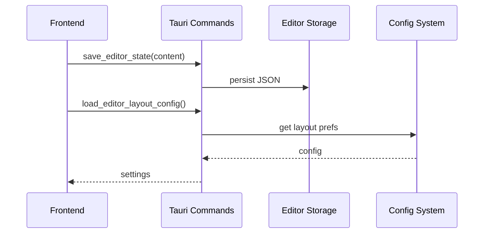

# Editor Feature Documentation

## Overview

The Editor feature provides a comprehensive rich text editing experience with integrated AI capabilities for content generation and transformation, built on Lexical with modular architecture.

## Architecture

### Frontend (`src/features/editor/`)

```
src/features/editor/
├── ai-generator/       # AI content generation
├── ai-transformer/     # AI text transformation with presets
├── editor/            # Core rich text editor
├── shared/            # Common types and utilities
└── index.ts           # Public API exports
```

**Sub-Features:**
- **AI Generator**: Content creation with streaming AI responses
- **AI Transformer**: Text transformation using presets
- **Editor Core**: Lexical-based editing with persistence
- **Shared**: Types and markdown utilities

### Backend

**Editor Storage (`src-tauri/src/editor/`):**
- `save_editor_state()`: Persists editor content as JSON
- `load_editor_state()`: Loads saved editor content
- `clear_editor_state()`: Clears saved state

**Config System:**
- `load_editor_layout_config()`: Panel visibility preferences
- `save_editor_layout_config()`: Layout settings
- `load_ai_generator_config()`: Generator prompt settings
- `save_ai_generator_config()`: Generator config
- Transform presets via config commands

## Integration Flow



## API Reference

### Main Components

- `Editor`: Main component with AI panels integration
- `AiGenerator`: Standalone generation component
- `AiTransformer`: Standalone transformation component

### Runtime Interface

**AIRuntimeInstance**: `{isLoading, isStreaming, currentStream, error, startStream, cancelStream, clearStream}`

### Backend Commands

- `save_editor_state(state)`: Persists editor content
- `load_editor_state()`: Returns saved content
- `clear_editor_state()`: Removes saved state
- Config commands for layout, generator, presets

## Key Features

- **Rich Text Editing**: Lexical-based with formatting toolbar
- **AI Generation**: Streaming content creation with preview
- **AI Transformation**: Preset-based text modification
- **Persistence**: Automatic content and settings saving
- **Responsive Layout**: Collapsible AI panels
- **Internationalization**: Full i18n support

## Usage Example

```tsx
import { Editor } from '@/features/editor';
import type { AIRuntimeInstance } from '@/features/editor/shared';

function App() {
  const runtime: AIRuntimeInstance = {
    // AI runtime implementation
    isLoading: false,
    isStreaming: false,
    currentStream: '',
    error: null,
    startStream: async (sys, user) => { /* ... */ },
    cancelStream: async () => { /* ... */ },
    clearStream: () => { /* ... */ },
  };

  return (
    <Editor
      onChange={(content) => console.log(content)}
      transformerRuntime={runtime}
      generatorRuntime={runtime}
    />
  );
}