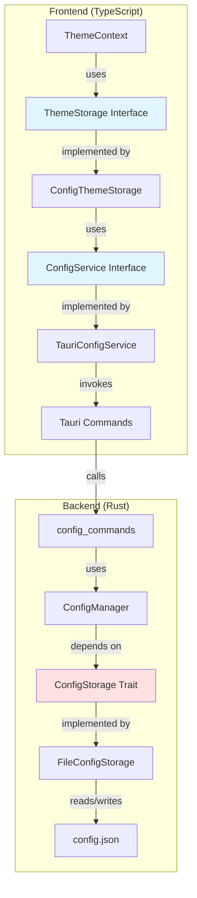
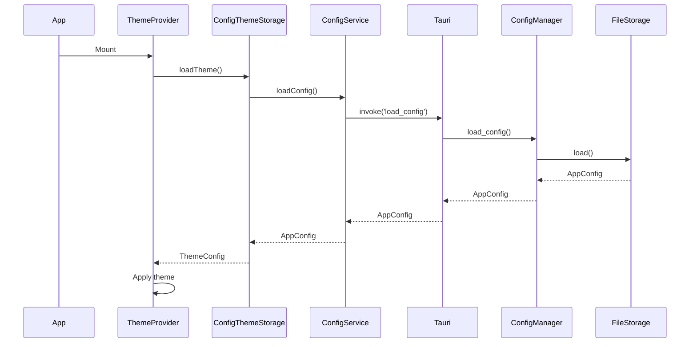
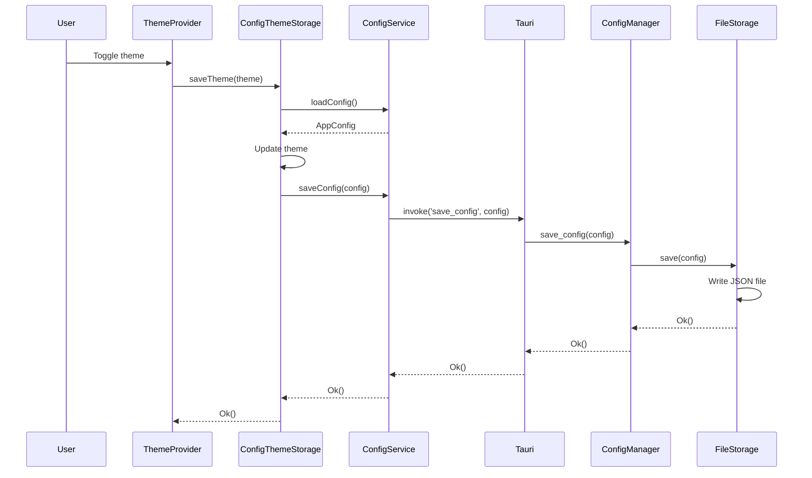

# Configuration Management System

## Overview

The Configuration Management System provides persistent storage for application settings using a Rust backend with JSON file storage.

## Architecture



## Key Components

### Backend (Rust)

#### 1. Configuration Types ([`src-tauri/src/config/types.rs`](../../src-tauri/src/config/types.rs))

Defines the configuration data structures:

```rust
#[derive(Debug, Clone, Serialize, Deserialize)]
pub struct AppConfig {
    pub theme: ThemeConfig,
}

#[derive(Debug, Clone, Serialize, Deserialize)]
pub struct ThemeConfig {
    pub dark_mode: bool,
}
```

**Features:**
- Serializable to/from JSON
- Default implementations for initial state
- Extensible for future configuration options

#### 2. Configuration Storage Trait ([`src-tauri/src/config/storage.rs`](../../src-tauri/src/config/storage.rs))

Defines the abstraction for configuration persistence:

```rust
pub trait ConfigStorage: Send + Sync {
    fn load(&self) -> Result<AppConfig, ConfigError>;
    fn save(&self, config: &AppConfig) -> Result<(), ConfigError>;
}
```

**Implementation: FileConfigStorage**
- Stores configuration in JSON format
- Automatically creates parent directories
- Returns default config if file doesn't exist
- Thread-safe (Send + Sync)

**File Location:**
- Platform-specific app data directory
- Path: `{APP_DATA_DIR}/config.json`

#### 3. Configuration Manager ([`src-tauri/src/config/manager.rs`](../../src-tauri/src/config/manager.rs))

Manages configuration business logic:

```rust
pub struct ConfigManager<S: ConfigStorage> {
    storage: Arc<S>,
}
```

**Methods:**
- [`load_config()`](../../src-tauri/src/config/manager.rs:20) - Load configuration from storage
- [`save_config()`](../../src-tauri/src/config/manager.rs:25) - Save configuration to storage
- [`update_config()`](../../src-tauri/src/config/manager.rs:30) - Atomic update with closure

**Design Benefits:**
- Generic over storage implementation (DIP)
- Thread-safe with Arc
- Clonable for sharing across threads

#### 4. Error Handling ([`src-tauri/src/config/error.rs`](../../src-tauri/src/config/error.rs))

Comprehensive error types:

```rust
pub enum ConfigError {
    IoError(String),
    SerializationError(String),
    DeserializationError(String),
    InvalidPath(String),
}
```

**Features:**
- Implements Display and Error traits
- Automatic conversion from std::io::Error
- Automatic conversion from serde_json::Error
- Serializable for frontend communication

#### 5. Tauri Commands ([`src-tauri/src/commands/config_commands.rs`](../../src-tauri/src/commands/config_commands.rs))

Exposes configuration operations to frontend:

```rust
#[tauri::command]
pub async fn load_config(
    manager: State<'_, ConfigManager<FileConfigStorage>>,
) -> Result<AppConfig, String>

#[tauri::command]
pub async fn save_config(
    config: AppConfig,
    manager: State<'_, ConfigManager<FileConfigStorage>>,
) -> Result<(), String>
```

### Frontend (TypeScript)

#### 1. Configuration Service ([`src/features/configuration/services/config.service.ts`](../../src/features/configuration/services/config.service.ts))

Provides abstraction for configuration operations:

```typescript
export interface ConfigService {
  loadConfig(): Promise<AppConfig>;
  saveConfig(config: AppConfig): Promise<void>;
}
```

**Implementation: TauriConfigService**
- Invokes Rust backend commands
- Type-safe with TypeScript interfaces
- Singleton pattern for global access

#### 2. Configuration Types ([`src/features/configuration/types.ts`](../../src/features/configuration/types.ts))

TypeScript types matching Rust structures:

```typescript
export interface AppConfig {
  theme: ThemeConfig;
}

export interface ThemeConfig {
  dark_mode: boolean;
}
```

**Note:** These types should be auto-generated from Rust using `tauri bindings` command in production.

#### 3. Theme Storage Bridge ([`src/theme/ConfigThemeStorage.ts`](../../src/theme/ConfigThemeStorage.ts))

Bridges theme system with configuration service:

```typescript
export class ConfigThemeStorage implements ThemeStorage {
  async loadTheme(): Promise<ThemeConfig>
  async saveTheme(theme: ThemeConfig): Promise<void>
}
```

**Responsibilities:**
- Implements ThemeStorage interface
- Delegates to ConfigService
- Handles theme-specific configuration

## Data Flow

### Loading Configuration



### Saving Configuration



## Usage Examples

### Backend: Adding New Configuration Fields

1. **Update types** in [`src-tauri/src/config/types.rs`](../../src-tauri/src/config/types.rs):

```rust
#[derive(Debug, Clone, Serialize, Deserialize)]
pub struct AppConfig {
    pub theme: ThemeConfig,
    pub editor: EditorConfig,  // New field
}

#[derive(Debug, Clone, Serialize, Deserialize)]
pub struct EditorConfig {
    pub auto_save: bool,
    pub font_size: u32,
}

impl Default for EditorConfig {
    fn default() -> Self {
        Self {
            auto_save: true,
            font_size: 14,
        }
    }
}
```

2. **Update default implementation**:

```rust
impl Default for AppConfig {
    fn default() -> Self {
        Self {
            theme: ThemeConfig::default(),
            editor: EditorConfig::default(),
        }
    }
}
```