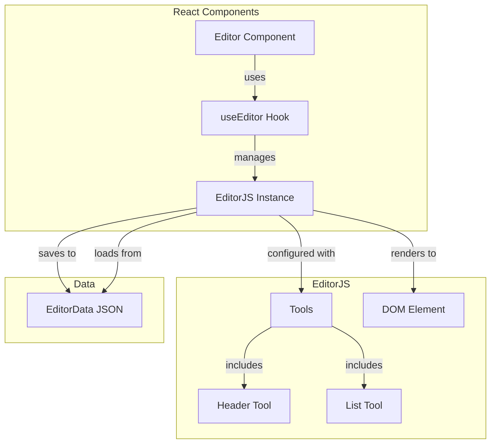
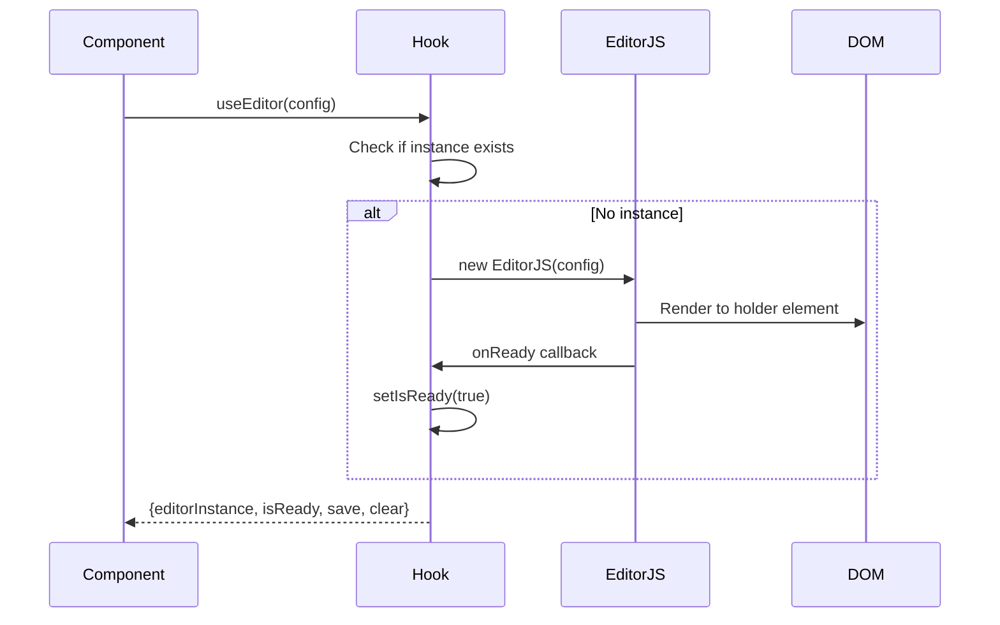
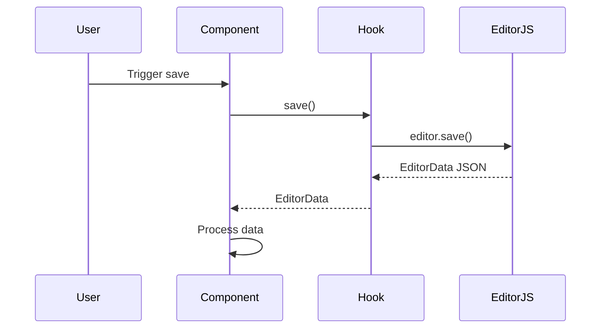
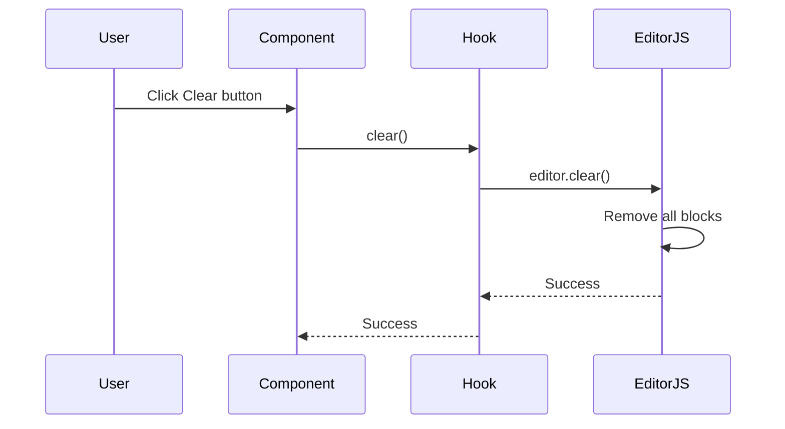

# Editor Feature

## Overview

The Editor feature provides a rich text editing experience using EditorJS, a block-styled editor with a clean JSON output. It supports multiple content blocks including headers, paragraphs, and lists.

## Architecture



## Key Components

### 1. Editor Component ([`src/features/editor/components/Editor.tsx`](../../src/features/editor/components/Editor.tsx))

Main React component that renders the editor interface:

```typescript
interface EditorProps {
  placeholder?: string;
  minHeight?: number;
}

export const Editor: React.FC<EditorProps>
```

**Features:**
- Configurable placeholder text
- Dark mode support
- Responsive design

**Props:**
- `placeholder`: Custom placeholder text (optional)
- `minHeight`: Minimum editor height in pixels (optional)

### 2. useEditor Hook ([`src/features/editor/hooks/useEditor.ts`](../../src/features/editor/hooks/useEditor.ts))

Custom React hook that manages EditorJS lifecycle:

```typescript
export const useEditor = (config: EditorConfig): UseEditorReturn
```

**Configuration:**
```typescript
interface EditorConfig {
  holder: string;        // DOM element ID
  placeholder?: string;  // Placeholder text
  minHeight?: number;    // Minimum height
}
```

**Returns:**
```typescript
interface UseEditorReturn {
  editorInstance: EditorJS | null;
  isReady: boolean;
  save: () => Promise<EditorData | undefined>;
  clear: () => Promise<void>;
}
```

**Lifecycle Management:**
- Initializes EditorJS on mount
- Cleans up on unmount
- Prevents memory leaks
- Handles ready state

### 3. Editor Types ([`src/features/editor/types.ts`](../../src/features/editor/types.ts))

TypeScript type definitions for the editor:

```typescript
export interface EditorConfig {
  holder: string;
  placeholder?: string;
  minHeight?: number;
}

export interface EditorData {
  time?: number;
  blocks: EditorBlock[];
  version?: string;
}

export interface EditorBlock {
  id?: string;
  type: string;
  data: Record<string, any>;
}

export interface UseEditorReturn {
  editorInstance: EditorJS | null;
  isReady: boolean;
  save: () => Promise<EditorData | undefined>;
  clear: () => Promise<void>;
}
```

## EditorJS Configuration

### Installed Tools

#### 1. Header Tool ([`@editorjs/header`](https://github.com/editor-js/header))

Provides heading blocks with configurable levels:

```typescript
header: {
  class: Header as unknown as ToolConstructable,
  config: {
    placeholder: 'Enter a header',
    levels: [1, 2, 3, 4, 5, 6],
    defaultLevel: 2,
  },
}
```

**Features:**
- 6 heading levels (H1-H6)
- Customizable placeholder
- Default level configuration

#### 2. List Tool ([`@editorjs/list`](https://github.com/editor-js/list))

Provides ordered and unordered lists:

```typescript
list: {
  class: List as unknown as ToolConstructable,
  inlineToolbar: true,
}
```

**Features:**
- Ordered lists (numbered)
- Unordered lists (bullets)
- Inline toolbar support

### Default Content

The editor initializes with default content:

```typescript
data: {
  blocks: [
    {
      type: 'header',
      data: { text: 'Welcome', level: 2 },
    },
    {
      type: 'paragraph',
      data: { text: 'This is the first paragraph of default content.' },
    },
    {
      type: 'paragraph',
      data: { text: 'This is the second paragraph of default content.' },
    },
  ],
}
```

## Data Flow

### Editor Initialization



### Saving Content



### Clearing Content



## Usage Examples

### Basic Usage

```typescript
import { Editor } from '@/features/editor';

export const MyPage = () => {
  return (
    <div>
      <h1>My Editor Page</h1>
      <Editor 
        placeholder="Start writing..."
        minHeight={400}
      />
    </div>
  );
};
```

## Styling

### Editor Styles ([`src/features/editor/editor.css`](../../src/features/editor/editor.css))

Custom styles for the editor:

```css
/* Editor container styles */
.codex-editor {
  /* Custom styles */
}

/* Dark mode support */
.dark .codex-editor {
  /* Dark mode styles */
}
```

### Component Styling

The Editor component uses Tailwind CSS classes:

```tsx
<div className="bg-white dark:bg-gray-800 rounded-lg shadow-lg p-6">
  <div id="editorjs" 
       className="prose dark:prose-invert max-w-none border border-gray-200 dark:border-gray-700 rounded-lg p-4 min-h-[300px] bg-white dark:bg-gray-900"
  />
</div>
```

**Features:**
- Responsive design
- Dark mode support
- Prose styling for content
- Bordered container
- Configurable minimum height

## Data Format

### EditorJS Output Format

```json
{
  "time": 1672531200000,
  "blocks": [
    {
      "id": "unique-block-id",
      "type": "header",
      "data": {
        "text": "My Heading",
        "level": 2
      }
    },
    {
      "id": "another-block-id",
      "type": "paragraph",
      "data": {
        "text": "This is a paragraph with <b>bold</b> text."
      }
    },
    {
      "id": "list-block-id",
      "type": "list",
      "data": {
        "style": "unordered",
        "items": [
          "First item",
          "Second item",
          "Third item"
        ]
      }
    }
  ],
  "version": "2.31.0"
}
```

### Block Types

#### Header Block
```json
{
  "type": "header",
  "data": {
    "text": "Heading text",
    "level": 2
  }
}
```

#### Paragraph Block
```json
{
  "type": "paragraph",
  "data": {
    "text": "Paragraph text with <i>formatting</i>"
  }
}
```

#### List Block
```json
{
  "type": "list",
  "data": {
    "style": "ordered",
    "items": ["Item 1", "Item 2"]
  }
}
```

## Error Handling

### Save Errors

```typescript
const save = async (): Promise<EditorData | undefined> => {
  if (editorRef.current) {
    try {
      const outputData = await editorRef.current.save();
      return outputData as EditorData;
    } catch (error) {
      console.error('Error saving editor data:', error);
      return undefined;
    }
  }
  return undefined;
};
```

### Clear Errors

```typescript
const clear = async (): Promise<void> => {
  if (editorRef.current) {
    try {
      await editorRef.current.clear();
    } catch (error) {
      console.error('Error clearing editor:', error);
    }
  }
};
```

## File Structure

```
src/features/editor/
├── index.ts                    # Feature exports
├── types.ts                    # TypeScript types
├── editor.css                  # Custom styles
├── components/
│   └── Editor.tsx              # Main editor component
└── hooks/
    └── useEditor.ts            # Editor lifecycle hook
```

## Related Documentation

- [UI Components](./ui-components.md) - Reusable UI components
- [Architecture Overview](../architecture.md) - Design principles
- [Developer Guide](../developer-guide.md) - Adding features