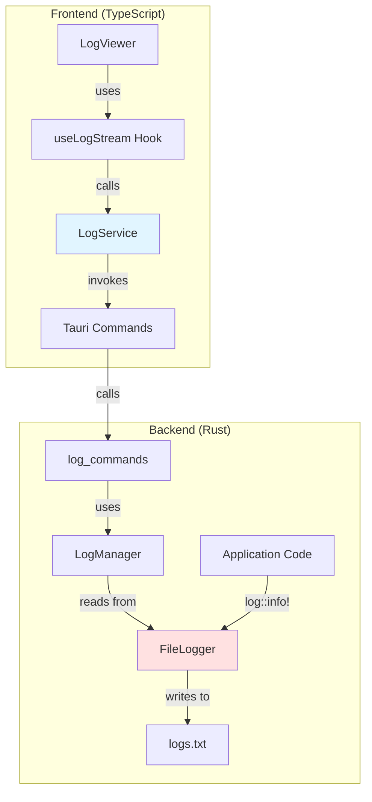
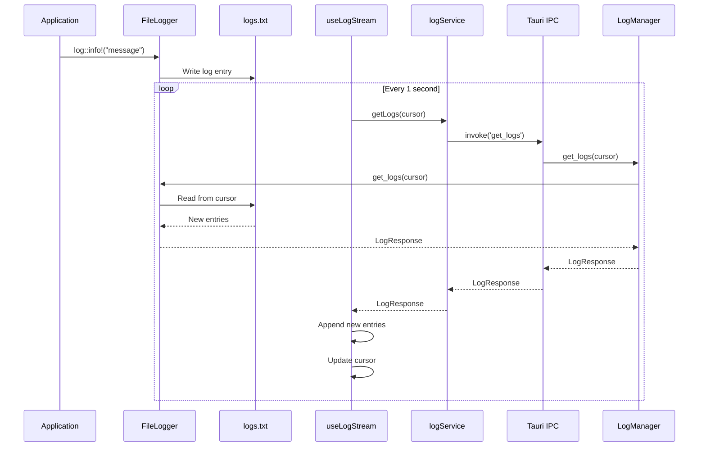

# Logging System

## Overview

The Logging System provides real-time application logging with file persistence, cursor-based streaming, and a web-based viewer with filtering capabilities.

## Architecture



## Key Components

### Backend (Rust)

#### 1. File Logger ([`src-tauri/src/logging/logger.rs`](../../src-tauri/src/logging/logger.rs))

Custom logger implementation that writes to a file:

```rust
pub struct FileLogger {
    file: Mutex<File>,
    log_path: PathBuf,
}
```

**Features:**
- Thread-safe file writing with Mutex
- Implements `log::Log` trait
- Cursor-based log reading for streaming
- Parses log entries from formatted lines
- Format: `[TIMESTAMP] [LEVEL] [TARGET] MESSAGE`

**Methods:**
- `new(log_path)` - Initialize logger with file path
- `get_logs(cursor)` - Read logs from cursor position
- `get_all_logs()` - Read all logs (cursor = 0)
- `clear()` - Truncate log file

#### 2. Log Manager ([`src-tauri/src/logging/manager.rs`](../../src-tauri/src/logging/manager.rs))

Manages log operations:

```rust
pub struct LogManager {
    logger: Arc<FileLogger>,
}
```

**Methods:**
- `get_logs(cursor)` - Retrieve logs from position
- `get_all_logs()` - Retrieve all logs
- `clear_logs()` - Clear log file

#### 3. Log Types ([`src-tauri/src/logging/types.rs`](../../src-tauri/src/logging/types.rs))

Data structures for log entries:

```rust
pub struct LogEntry {
    pub timestamp: String,
    pub level: String,
    pub target: String,
    pub message: String,
}

pub struct LogResponse {
    pub entries: Vec<LogEntry>,
    pub cursor: u64,
}
```

#### 4. Tauri Commands ([`src-tauri/src/commands/log_commands.rs`](../../src-tauri/src/commands/log_commands.rs))

Exposes logging operations to frontend:

```rust
#[tauri::command]
pub async fn get_logs(cursor: u64, log_manager: State<'_, LogManager>) 
    -> Result<LogResponse, String>

#[tauri::command]
pub async fn get_all_logs(log_manager: State<'_, LogManager>) 
    -> Result<LogResponse, String>

#[tauri::command]
pub async fn clear_logs(log_manager: State<'_, LogManager>) 
    -> Result<(), String>
```

### Frontend (TypeScript)

#### 1. Log Service ([`src/features/logging/services/log.service.ts`](../../src/features/logging/services/log.service.ts))

API client for log operations:

```typescript
export const logService = {
  getLogs(cursor: number): Promise<LogResponse>
  getAllLogs(): Promise<LogResponse>
  clearLogs(): Promise<void>
}
```

#### 2. Log Stream Hook ([`src/features/logging/hooks/useLogStream.ts`](../../src/features/logging/hooks/useLogStream.ts))

React hook for real-time log streaming:

```typescript
const {
  logs,              // All logs
  filteredLogs,      // Filtered logs
  isLoading,         // Loading state
  error,             // Error message
  clearLogs,         // Clear function
  setFilterLevel,    // Set log level filter
  setSearchTerm,     // Set search term
  autoScroll,        // Auto-scroll state
  toggleAutoScroll,  // Toggle auto-scroll
} = useLogStream({ pollInterval: 1000 });
```

**Features:**
- Automatic polling for new logs
- Cursor-based incremental loading
- Level filtering (ALL, TRACE, DEBUG, INFO, WARN, ERROR)
- Text search across messages and targets
- Auto-scroll toggle

#### 3. Log Viewer Component ([`src/features/logging/components/LogViewer.tsx`](../../src/features/logging/components/LogViewer.tsx))

UI component for viewing logs:

**Features:**
- Real-time log display with color-coded levels
- Level filtering dropdown
- Search input
- Auto-scroll toggle
- Clear logs button
- Copy to clipboard
- Download logs as text file
- Monospace font with syntax highlighting

#### 4. Log Types ([`src/features/logging/types.ts`](../../src/features/logging/types.ts))

TypeScript types matching Rust structures:

```typescript
export interface LogEntry {
  timestamp: string;
  level: string;
  target: string;
  message: string;
}

export interface LogResponse {
  entries: LogEntry[];
  cursor: number;
}

export type LogLevel = 'ALL' | 'TRACE' | 'DEBUG' | 'INFO' | 'WARN' | 'ERROR';
```

## Data Flow

### Real-time Log Streaming



## Usage Examples

### Backend: Adding Logs

```rust
// In any Rust file
use log::{trace, debug, info, warn, error};

// Different log levels
trace!("Detailed trace information");
debug!("Debug information: {:?}", some_value);
info!("Operation completed successfully");
warn!("Warning: potential issue detected");
error!("Error occurred: {}", error_message);

// In commands
#[tauri::command]
pub async fn my_command() -> Result<String, String> {
    log::debug!("my_command invoked");
    
    match perform_operation() {
        Ok(result) => {
            log::info!("Operation successful");
            Ok(result)
        }
        Err(e) => {
            log::error!("Operation failed: {}", e);
            Err(e.to_string())
        }
    }
}
```

### Frontend: Using the Log Viewer

```typescript
// In a page component
import { LogViewer } from '../features/logging';

export const LogsPage = () => {
  return <LogViewer />;
};
```

```typescript
// Custom usage with the hook
import { useLogStream } from '../features/logging';

const MyComponent = () => {
  const { filteredLogs, setFilterLevel, clearLogs } = useLogStream({
    pollInterval: 2000,  // Poll every 2 seconds
    autoScroll: true,
  });

  return (
    <div>
      <button onClick={() => setFilterLevel('ERROR')}>
        Show Errors Only
      </button>
      <button onClick={clearLogs}>Clear</button>
      {filteredLogs.map((log, i) => (
        <div key={i}>{log.message}</div>
      ))}
    </div>
  );
};
```

## Initialization

The logging system is initialized in [`src-tauri/src/lib.rs`](../../src-tauri/src/lib.rs):

```rust
use logging::{init_logger, LogManager};

pub fn run() {
    tauri::Builder::default()
        .setup(|app| {
            let app_data_dir = app.path().app_data_dir()
                .expect("Failed to get app data directory");
            
            // Initialize logger
            let log_path = app_data_dir.join("logs.txt");
            let logger = init_logger(log_path, log::Level::Trace)
                .expect("Failed to initialize logger");
            
            // Create log manager
            let log_manager = LogManager::new(logger);
            app.manage(log_manager);
            
            Ok(())
        })
        .invoke_handler(tauri::generate_handler![
            get_logs, 
            get_all_logs, 
            clear_logs
        ])
        .run(tauri::generate_context!())
        .expect("error while running tauri application");
}
```

## Log File Location

- **Path:** `{APP_DATA_DIR}/logs.txt`
- **Format:** Plain text, one entry per line
- **Persistence:** Truncated on app restart
- **Thread-safe:** Multiple threads can write concurrently

## Dependencies

### Rust
```toml
log = "0.4.28"
env_logger = "0.11.8"  # Not used, can be removed
chrono = "0.4.42"
```

### TypeScript
- Uses Tauri's `invoke` API
- No additional dependencies required

## Best Practices

1. **Use appropriate log levels:**
   - `TRACE` - Very detailed information
   - `DEBUG` - Debugging information
   - `INFO` - General information
   - `WARN` - Warning messages
   - `ERROR` - Error messages

2. **Include context in log messages:**
   ```rust
   log::info!("User {} logged in successfully", user_id);
   log::error!("Failed to save file {}: {}", path, error);
   ```

3. **Log before throwing errors:**
   ```rust
   if let Err(e) = operation() {
       log::error!("Operation failed: {}", e);
       return Err(e);
   }
   ```

4. **Use structured logging for complex data:**
   ```rust
   log::debug!("Config loaded: {:?}", config);
   ```

## Performance Considerations

- **Cursor-based reading:** Only new logs are transmitted to frontend
- **Polling interval:** Default 1 second, configurable
- **File I/O:** Buffered writes with automatic flushing
- **Memory:** Logs accumulate in frontend; clear periodically for long-running sessions
- **Thread safety:** Mutex-protected file access prevents corruption
