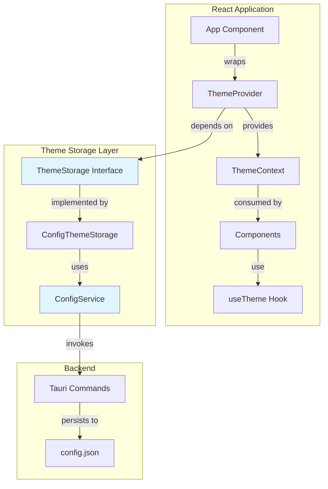
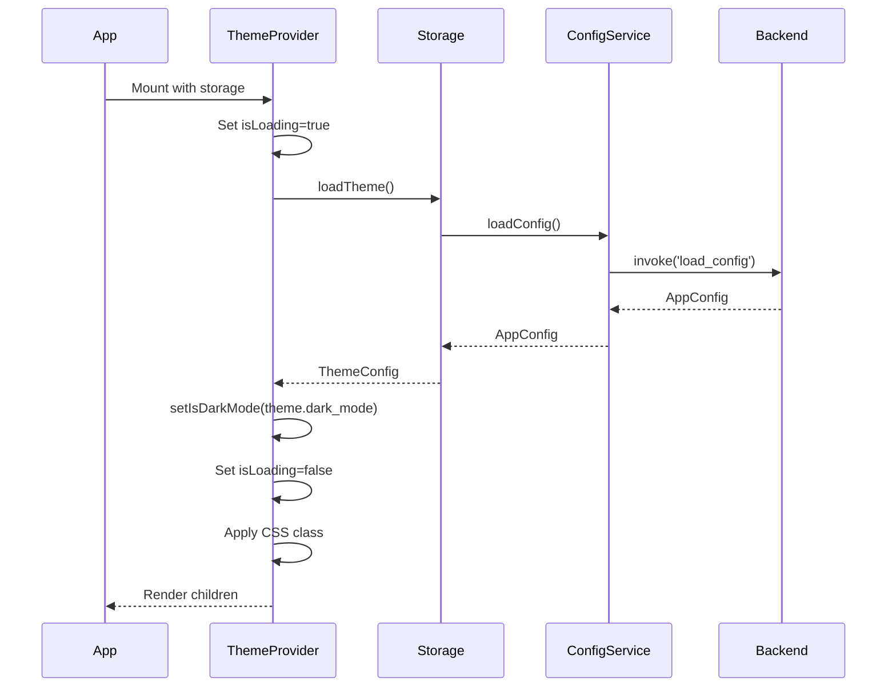
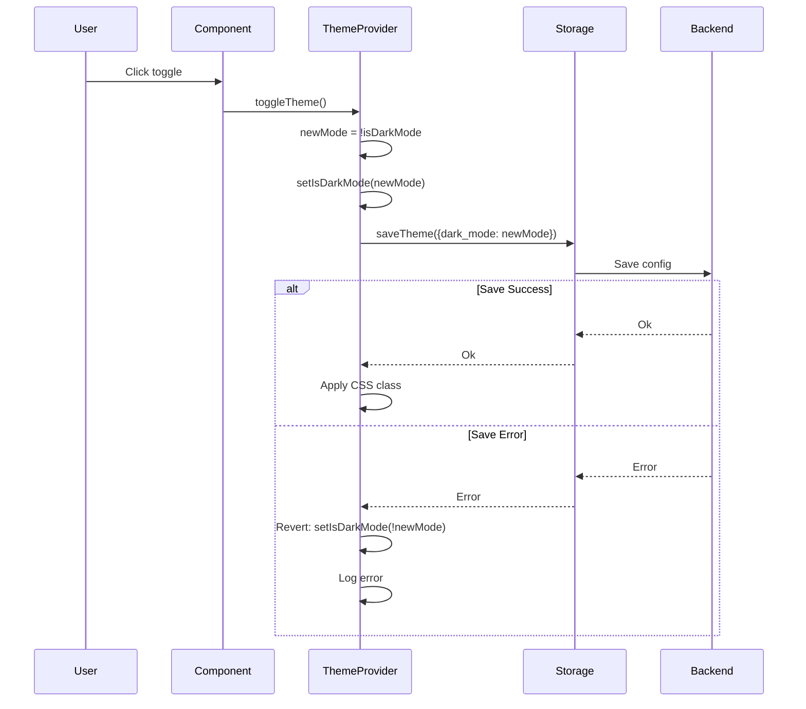

# Theme System

## Overview

The Theme System provides dark/light mode functionality with persistent storage across application sessions. It integrates with the Configuration Management System to save user preferences.

## Architecture



## Key Components

### Frontend Components

#### 1. ThemeStorage Interface ([`src/theme/ThemeStorage.interface.ts`](../../src/theme/ThemeStorage.interface.ts))

Defines the abstraction for theme persistence:

```typescript
export interface ThemeConfig {
  dark_mode: boolean;
}

export interface ThemeStorage {
  loadTheme(): Promise<ThemeConfig>;
  saveTheme(theme: ThemeConfig): Promise<void>;
}
```

**Purpose:**
- Decouples theme system from storage implementation (DIP)
- Allows different storage backends (config, localStorage, cloud)
- Enables easy testing with mock implementations

#### 2. ConfigThemeStorage ([`src/theme/ConfigThemeStorage.ts`](../../src/theme/ConfigThemeStorage.ts))

Concrete implementation using configuration service:

```typescript
export class ConfigThemeStorage implements ThemeStorage {
  async loadTheme(): Promise<ThemeConfig> {
    const config = await configService.loadConfig();
    return config.theme;
  }

  async saveTheme(theme: ThemeConfig): Promise<void> {
    const config = await configService.loadConfig();
    config.theme = theme;
    await configService.saveConfig(config);
  }
}
```

**Responsibilities:**
- Bridges theme system with configuration management
- Handles theme-specific configuration operations
- Singleton pattern for global access

#### 3. ThemeProvider ([`src/theme/ThemeContext.tsx`](../../src/theme/ThemeContext.tsx))

React context provider for theme state:

```typescript
interface ThemeProviderProps {
  children: ReactNode;
  storage: ThemeStorage; // Dependency injection
}

export const ThemeProvider: React.FC<ThemeProviderProps>
```

**Features:**
- Loads theme from storage on mount
- Applies theme to DOM via CSS classes
- Provides [`toggleTheme()`](../../src/theme/ThemeContext.tsx:47) function
- Handles loading states
- Error handling with automatic revert

**State Management:**
- `isDarkMode`: Current theme state
- `isLoading`: Loading indicator during initialization

#### 4. useTheme Hook ([`src/theme/ThemeContext.tsx`](../../src/theme/ThemeContext.tsx:78))

Custom hook for consuming theme context:

```typescript
export const useTheme = (): ThemeContextType => {
  const context = useContext(ThemeContext);
  if (context === undefined) {
    throw new Error('useTheme must be used within a ThemeProvider');
  }
  return context;
};
```

**Returns:**
- `isDarkMode`: Boolean indicating current theme
- `toggleTheme`: Function to switch themes

#### 5. DarkModeToggle Component ([`src/components/ui/DarkModeToggle.tsx`](../../src/components/ui/DarkModeToggle.tsx))

UI component for theme switching:

```typescript
export const DarkModeToggle: React.FC = () => {
  const { isDarkMode, toggleTheme } = useTheme();
  // Renders toggle button
};
```

## Data Flow

### Theme Initialization



### Theme Toggle



## CSS Implementation

### Theme Variables ([`src/theme/theme.css`](../../src/theme/theme.css))

The theme system uses CSS custom properties that automatically switch based on the `.dark` class:

```css
:root {
  /* Light mode colors */
  --color-background: #ffffff;
  --color-text: #000000;
}

.dark {
  /* Dark mode colors */
  --color-background: #1a1a1a;
  --color-text: #ffffff;
}
```

### Applying Themes

The ThemeProvider automatically adds/removes the `dark` class on `document.documentElement`:

```typescript
useEffect(() => {
  if (isDarkMode) {
    document.documentElement.classList.add('dark');
  } else {
    document.documentElement.classList.remove('dark');
  }
}, [isDarkMode]);
```

## Usage Examples

### Setting Up Theme System

In [`src/main.tsx`](../../src/main.tsx):

```typescript
import { ThemeProvider, configThemeStorage } from './theme';

ReactDOM.createRoot(document.getElementById("root") as HTMLElement).render(
  <React.StrictMode>
    <BrowserRouter>
      <ThemeProvider storage={configThemeStorage}>
        <App />
      </ThemeProvider>
    </BrowserRouter>
  </React.StrictMode>
);
```

### Using Theme in Components

```typescript
import { useTheme } from '@/theme';

export const MyComponent = () => {
  const { isDarkMode, toggleTheme } = useTheme();
  
  return (
    <div className="bg-white dark:bg-gray-800">
      <p className="text-gray-900 dark:text-white">
        Current theme: {isDarkMode ? 'Dark' : 'Light'}
      </p>
      <button onClick={toggleTheme}>
        Toggle Theme
      </button>
    </div>
  );
};
```

### Using Tailwind Dark Mode Classes

```tsx
<div className="bg-white dark:bg-gray-900">
  <h1 className="text-gray-900 dark:text-white">Title</h1>
  <p className="text-gray-600 dark:text-gray-300">Content</p>
</div>
```

### Creating Custom Theme Storage

```typescript
import type { ThemeStorage, ThemeConfig } from '@/theme/ThemeStorage.interface';

export class LocalStorageThemeStorage implements ThemeStorage {
  private readonly key = 'app-theme';
  
  async loadTheme(): Promise<ThemeConfig> {
    const stored = localStorage.getItem(this.key);
    if (stored) {
      return JSON.parse(stored);
    }
    return { dark_mode: false };
  }
  
  async saveTheme(theme: ThemeConfig): Promise<void> {
    localStorage.setItem(this.key, JSON.stringify(theme));
  }
}

// Use in main.tsx
const storage = new LocalStorageThemeStorage();
<ThemeProvider storage={storage}>
```

## Design Principles

### Dependency Inversion Principle (DIP)

- [`ThemeProvider`](../../src/theme/ThemeContext.tsx:17) depends on [`ThemeStorage`](../../src/theme/ThemeStorage.interface.ts:10) interface, not concrete implementation
- Storage implementation is injected via props
- Easy to swap storage backends without modifying ThemeProvider

### Single Responsibility Principle (SRP)

- **ThemeStorage.interface**: Defines storage contract
- **ConfigThemeStorage**: Implements configuration-based storage
- **ThemeProvider**: Manages theme state and DOM updates
- **useTheme**: Provides theme access to components
- **DarkModeToggle**: UI for theme switching

### Open/Closed Principle (OCP)

- New storage implementations can be added without modifying existing code
- Theme system is open for extension (new storage backends)
- Closed for modification (core logic remains unchanged)

## File Structure

```
src/
├── theme/
│   ├── index.ts                      # Exports
│   ├── theme.css                     # CSS variables and dark mode styles
│   ├── ThemeStorage.interface.ts    # Storage abstraction
│   ├── ConfigThemeStorage.ts        # Configuration-based storage
│   └── ThemeContext.tsx              # Provider and hook
├── components/
│   └── ui/
│       └── DarkModeToggle.tsx        # Toggle component
└── main.tsx                          # Theme setup
```

## Error Handling

### Load Errors

If theme loading fails:
1. Error is logged to console
2. Default theme (light mode) is used
3. Application continues normally

```typescript
try {
  const theme = await storage.loadTheme();
  setIsDarkMode(theme.dark_mode);
} catch (error) {
  console.error('Failed to load theme:', error);
  // Uses default: isDarkMode = false
}
```

### Save Errors

If theme saving fails:
1. Error is logged to console
2. Theme state is reverted to previous value
3. User sees the original theme

```typescript
try {
  await storage.saveTheme({ dark_mode: newMode });
} catch (error) {
  console.error('Failed to save theme:', error);
  setIsDarkMode(!newMode); // Revert
}
```

## Performance Considerations

1. **Initial Load**: Theme is loaded once on application startup
2. **DOM Updates**: CSS class changes are efficient (single DOM operation)
3. **Persistence**: Theme is saved only when changed by user
4. **Loading State**: Prevents flash of unstyled content (FOUC)

## Related Documentation

- [Configuration Management](./configuration.md) - Backend for theme persistence
- [UI Components](./ui-components.md) - Components with theme support
- [Architecture Overview](../architecture.md) - Design principles

## Integration Points

### With Configuration System

Theme settings are stored as part of the application configuration:

```json
{
  "theme": {
    "dark_mode": true
  }
}
```

### With UI Components

All UI components should support dark mode using Tailwind's `dark:` prefix:

```tsx
<button className="bg-blue-500 dark:bg-blue-700">
  Button
</button>
```

### With Tailwind CSS

Tailwind is configured to use class-based dark mode in `tailwind.config.js`:

```javascript
module.exports = {
  darkMode: 'class',
  // ...
}