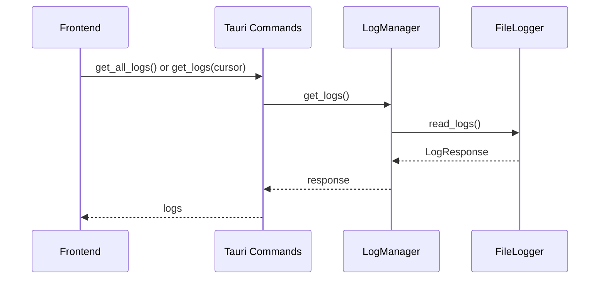

# Logging Feature Documentation

## Overview

The Logging feature provides real-time log viewing, filtering, and management with cursor-based streaming from the Rust backend, supporting log levels, search, and export functionality.

## Architecture

### Frontend (`src/features/logging/`)

```
src/features/logging/
├── components/          # UI components (LogViewer)
├── hooks/              # React hooks (useLogStream)
├── services/           # Tauri command wrappers
├── types.ts            # TypeScript definitions
└── index.ts            # Public API exports
```

**Key Components:**
- `LogViewer`: Main component with filtering, search, and export
- `useLogStream`: Hook for log streaming and state management

### Backend (`src-tauri/src/logging/`)

```
src-tauri/src/logging/
├── logger.rs            # FileLogger (file-based logging)
├── manager.rs           # LogManager (high-level API)
├── types.rs             # Data structures
└── mod.rs               # Public API
```

**Core Components:**
- **FileLogger**: Implements `log::Log` trait with concurrent read/write
- **LogManager**: Provides get_logs, get_all_logs, clear_logs methods

## Integration Flow



## API Reference

### Frontend Hooks

- `useLogStream(options)`: Returns `{logs, filteredLogs, isLoading, error, clearLogs, setFilterLevel, setSearchTerm, autoScroll, toggleAutoScroll}`

### Backend Commands

- `get_logs(cursor)`: Fetches logs from cursor position
- `get_all_logs()`: Fetches all available logs
- `clear_logs()`: Clears all logs

### Types

**LogEntry**: `{timestamp, level, target, message}`

**LogResponse**: `{entries: LogEntry[], cursor: number}`

**LogLevel**: `'ALL' | 'TRACE' | 'DEBUG' | 'INFO' | 'WARN' | 'ERROR'`

## Key Features

- **Real-time Streaming**: Polls for new logs with cursor-based incremental loading
- **Filtering**: By log level and search terms
- **Auto-scroll**: Automatic scrolling to new entries
- **Export**: Copy to clipboard or download as text file
- **Thread-safe**: Concurrent reads during writes
- **Performance**: Client-side filtering for responsiveness

## Usage Example

```tsx
import { LogViewer } from '@/features/logging';

function LogsPage() {
  return <LogViewer />;
}
```

```tsx
import { useLogStream } from '@/features/logging';

function CustomLogs() {
  const { filteredLogs, clearLogs, setFilterLevel } = useLogStream();

  return (
    <div>
      <button onClick={clearLogs}>Clear Logs</button>
      <select onChange={(e) => setFilterLevel(e.target.value)}>
        <option value="ALL">All</option>
        <option value="ERROR">Errors</option>
      </select>
      {filteredLogs.map((log, i) => (
        <div key={i}>[{log.level}] {log.message}</div>
      ))}
    </div>
  );
}