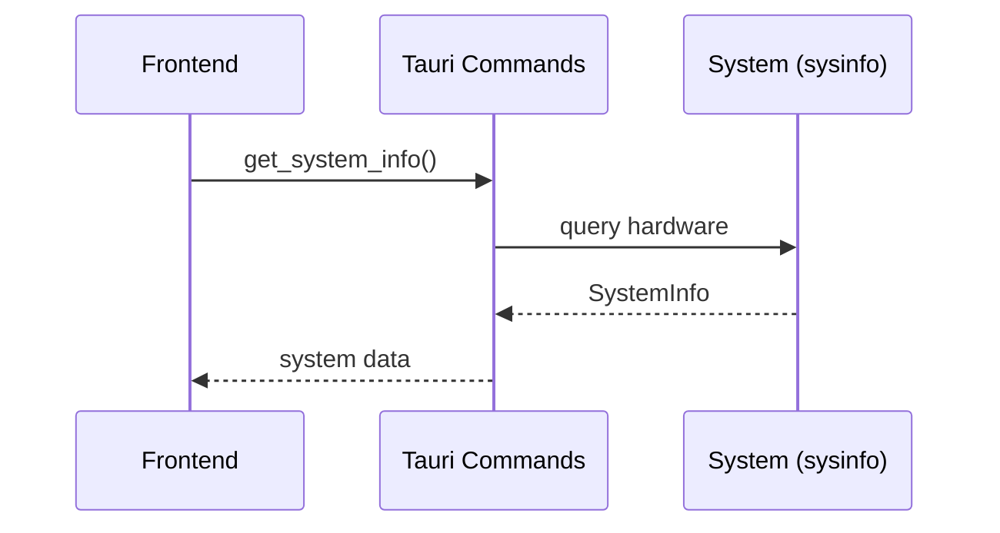

# System Info Feature Documentation

## Overview

The System Info feature displays comprehensive hardware and OS information including CPU, memory, disk, GPU, and OS details, fetched from system hardware via the Tauri backend.

## Architecture

### Frontend (`src/features/system-info/`)

```
src/features/system-info/
├── components/          # UI components (SystemInfo)
├── hooks/              # React hooks (useSystemInfo)
├── services/           # Tauri command wrappers
├── types.ts            # TypeScript definitions
└── index.ts            # Public API exports
```

**Key Components:**
- `SystemInfo`: Main component displaying system specs in cards
- `useSystemInfo`: Hook for data fetching and state management

### Backend (`src-tauri/src/commands/system_commands.rs`)

**Command:**
- `get_system_info()`: Returns SystemInfo using sysinfo crate

## Integration Flow



## API Reference

### Frontend Hooks

- `useSystemInfo(service)`: Returns `{systemInfo, isLoading, error}`

### Backend Commands

- `get_system_info()`: Returns SystemInfo with CPU, memory, disk, GPU, OS details

### Types

**SystemInfo**: `{cpuCores, cpuName, totalMemoryGb, availableMemoryGb, osName, osVersion, architecture, totalDiskGb, availableDiskGb, gpuInfo[]}`

## Key Features

- **Hardware Detection**: CPU cores, memory, disk space, GPU info
- **OS Information**: Name, version, architecture
- **Responsive Design**: Grid layout adapting to screen sizes
- **Theme Support**: Light/dark mode compatible
- **Internationalization**: i18n for labels
- **Error Handling**: Graceful error states

## Usage Example

```tsx
import { SystemInfo, systemInfoService } from '@/features/system-info';

function SystemPage() {
  return <SystemInfo service={systemInfoService} />;
}
```

```tsx
import { useSystemInfo, systemInfoService } from '@/features/system-info';

function CustomSystem() {
  const { systemInfo, isLoading } = useSystemInfo(systemInfoService);

  if (isLoading) return <div>Loading...</div>;

  return (
    <div>
      <p>CPU: {systemInfo?.cpuName} ({systemInfo?.cpuCores} cores)</p>
      <p>Memory: {systemInfo?.availableMemoryGb}GB / {systemInfo?.totalMemoryGb}GB</p>
    </div>
  );
}